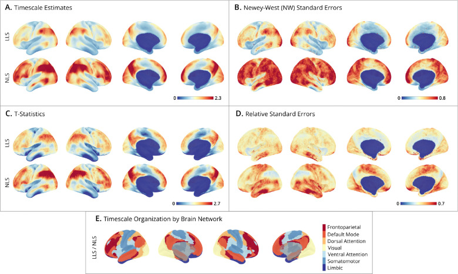

# 2026-05-05

## 1. Overview

Today's Gmail scan found 11 relevant academic alert emails from JNeurosci, NeuroImage, Journal of Vision, ARVO, Language, Cognition and Neuroscience, Neuropsychologia, PNAS, Trends in Cognitive Sciences, Imaging Neuroscience, and Developmental Cognitive Neuroscience.

This report does not only discuss the two recommended deep reads. The two deep reads are prioritized for careful reading, but all papers judged relevant to computational cognitive neuroscience, language/reading/speech, EEG/sEEG/ECoG/fMRI, systems neuroscience, development, memory, decision-making, or visual cognition are explained at an appropriate depth. Full-text papers receive full notes; papers available only through email metadata, title, abstract, or alert summaries receive shorter, clearly marked notes.

## 2. Recommended Deep Reads

| Priority | Paper | Source | Access status | Why it matters |
|---|---|---|---|---|
| 1 | Was that a rhetorical question? Electrophysiological signatures for the processing of information-seeking and rhetorical questions | Language, Cognition and Neuroscience | Full text currently readable | Directly relevant to language processing, pragmatic inference, prosody, EEG, and event-related potentials. A good entry point for language + EEG reasoning. |
| 2 | Estimating fMRI Timescale Maps | Imaging Neuroscience / PMC | Full text currently readable; figure saved | Directly relevant to fMRI, neural timescales, statistical modeling, robust standard errors, and inferential brain maps. |

## 3. Source And Paper Table

| Source                               | Paper                                                                                                                                    | Relevance   | Access status                                                                         | Handling                               |
| ------------------------------------ | ---------------------------------------------------------------------------------------------------------------------------------------- | ----------- | ------------------------------------------------------------------------------------- | -------------------------------------- |
| Language, Cognition and Neuroscience | Was that a rhetorical question?                                                                                                          | High        | Full text readable                                                                    | Full note                              |
| Imaging Neuroscience                 | Estimating fMRI Timescale Maps                                                                                                           | High        | Full text readable                                                                    | Full note with figure                  |
| Imaging Neuroscience                 | Global search metaheuristics for neural mass model calibration                                                                           | High        | Preprint/public entry readable; not fully expanded today                              | Short note; follow-up recommended      |
| Imaging Neuroscience                 | Dynamics-Informed Priors (DIP) for Neural Mass Modelling                                                                                 | High        | Preprint/public entry readable; not fully expanded today                              | Short note; follow-up recommended      |
| JNeurosci                            | 5imilar Response Dynamics Represent Opposite Behaviors and Rewards in Frontal Cortex                                                     | High        | Marked Open Access in email; should be searched via JNeurosci + exact title/PDF first | Short note; deep follow-up recommended |
| JNeurosci                            | Electrophysiological Brain Connectivity and Subjective States Evoked by Electrical Stimulation of the Human Mid-Thalamus                 | High        | JNeurosci OA/preprint entry readable; not fully expanded today                        | Short note; deep follow-up recommended |
| JNeurosci                            | Controlling spatio-temporal sequences of neural activity by local synaptic changes                                                       | High        | Not fully expanded today                                                              | Short note                             |
| NeuroImage                           | Influence of attention mechanisms on cerebellar and basal ganglia activity during vocal emotion decoding                                 | Medium-high | Open Access                                                                           | Short note                             |
| NeuroImage                           | Nonlinear shift along the sensorimotor-association-axis in brain responses to task performance                                           | Medium-high | Open Access                                                                           | Short note                             |
| Neuropsychologia                     | First-person perspective gesture observation in virtual reality: A novel approach for anomia rehabilitation in post-stroke aphasia       | Medium-high | ScienceDirect Open Access                                                             | Short note                             |
| Neuropsychologia                     | Patterns of language and visuospatial lateralisation in three-year-old children                                                          | Medium-high | ScienceDirect Open Access                                                             | Short note                             |
| Neuropsychologia                     | Behaviour and neural oscillations differentiate physical and digital versions of the Corsi block tapping task                            | Medium      | Needs article-level confirmation                                                      | Short note                             |
| Trends in Cognitive Sciences         | A neural state space for episodic memories                                                                                               | Medium-high | Marked Open Access                                                                    | Short note                             |
| Trends in Cognitive Sciences         | Dense longitudinal neuroimaging reveals individual brain change trajectories                                                             | Medium-high | Marked Open Access                                                                    | Short note                             |
| Trends in Cognitive Sciences         | Adaptive habits: understanding executive function and its development                                                                    | Medium      | Marked Open Access                                                                    | Short note                             |
| Journal of Vision                    | The effect of flashing lights on speed perception for lateral motion and motion in depth                                                 | Medium      | ARVO usually readable                                                                 | Short note                             |
| Developmental Cognitive Neuroscience | Problematic patterns of social media use increase with spontaneous cortical activity and transdiagnostic mental health symptoms in youth | Medium      | Open Access                                                                           | Short note                             |

## 4. Full Notes

### 4.1 Was that a rhetorical question? Electrophysiological signatures for the processing of information-seeking and rhetorical questions

Journal/source: Language, Cognition and Neuroscience

Authors: Mariya Kharaman, Bettina Braun, Carsten Eulitz

Link: [Taylor & Francis full article](https://www.tandfonline.com/doi/full/10.1080/23273798.2026.2644434)

Access status: full text currently readable.

Relevance: high.

Evidence used: full text.

#### 1. Prior Research

The paper starts from a core pragmatic fact: a sentence can have the grammatical form of a question without functioning as a genuine request for information. An information-seeking question asks the listener to provide missing information. A rhetorical question keeps the surface form of a question but usually expresses a stance, expectation, or implied assertion.

Prior linguistic work has shown that rhetorical questions are not just disguised declaratives. They preserve interrogative form but differ in communicative function. This makes them a useful case of indirect speech acts, where linguistic form and pragmatic function diverge.

Previous prosody studies showed that listeners can use intonation, especially fundamental frequency contours, to distinguish information-seeking questions from rhetorical questions. In German, rhetorical questions are often associated with a steep rising-falling nuclear accent, longer duration, and sometimes breathy voice quality. Perception studies suggest that F0 and intonation are primary cues, while voice quality and duration are secondary cues.

Prior EEG work has examined emotional prosody, irony, attitude prosody, and question-versus-statement processing. Event-related potentials are useful here because they show when the brain becomes sensitive to a prosodic or pragmatic mismatch. However, before this paper, the online electrophysiological processing of rhetorical questions had not been directly characterized.

#### 2. Gap

The main gap is temporal and mechanistic. We know that listeners can behaviorally distinguish rhetorical questions from information-seeking questions, and we know that prosody carries relevant cues. But we do not know when the brain detects the mismatch between expected speech act and actual prosody, or whether rhetorical questions require later, more integrative processing than information-seeking questions.

#### 3. Research Questions

1. Does EEG show a prediction-violation response when a visual cue predicts one speech act but the actual prosody indicates another?
2. Are information-seeking questions and rhetorical questions processed in different time windows?
3. Do both ERPs and neural oscillations reflect prosody-pragmatics congruency?
4. Do rhetorical questions require a later, more complete utterance-level interpretation?

#### 4. Experimental Design

Participants were 24 native German speakers. The stimuli were German wh-questions produced with prosodic contours associated with either information-seeking questions or rhetorical questions.

Each block began with a mnemonic visual cue. One cue led participants to expect an information-seeking question; another cue led them to expect a rhetorical question. Then they heard an auditory question. This created congruent trials, where cue and prosody matched, and incongruent trials, where cue and prosody mismatched.

The study recorded behavioral judgments and EEG. The main independent variables were speech-act type, cue-prosody congruency, and voice quality. The main dependent variables were accuracy, ERP amplitude, and exploratory alpha/beta-band activity.

The key ERP logic is straightforward: if two condition waveforms separate within a time window, the brain is treating the conditions differently. The paper reports an earlier effect for information-seeking questions around 530-590 ms, and a later effect for rhetorical questions around 1450-1570 ms.

#### 5. Findings

Behaviorally, participants could distinguish the intended question types, so the prosodic manipulation worked. In EEG, information-seeking questions showed an earlier congruency effect, while rhetorical questions showed a later effect. This supports the idea that rhetorical questions require more complete utterance-level and pragmatic integration.

The time-frequency results suggest alpha and beta involvement, but those analyses are more exploratory. The strongest conclusion is about timing: the two question types do not appear to be processed identically.

#### 6. Limitations And Discussion

The sample size is modest, and the task is a controlled cue-matching task rather than natural dialogue. In real conversation, listeners use context, speaker identity, facial expression, shared knowledge, and discourse history. The EEG data provide strong temporal information but weak spatial localization. Oscillation findings should be treated as hypothesis-generating.

#### 7. Comprehension Questions

1. Why does the later ERP effect for rhetorical questions suggest pragmatic integration rather than just acoustic difficulty?
2. Why did the experiment need a visual cue before the auditory question?

---

### 4.2 Estimating fMRI Timescale Maps

Journal/source: Imaging Neuroscience / PMC / public PDF

Authors: Gabriel Riegner, Samuel Davenport, Bradley Voytek, Armin Schwartzman

Links: [PubMed/PMC](https://pubmed.ncbi.nlm.nih.gov/40661518/); [public PDF](https://sjdavenport.github.io/research/papers/timescales.pdf)

Access status: full text currently readable.

Relevance: high.

Evidence used: full text.

Figure note: this figure shows group-level fMRI timescale maps from the Human Connectome Project. Each cortical vertex receives an estimated timescale in seconds. Panel A shows timescale estimates; B shows Newey-West standard errors; C shows t-statistics for testing whether timescale exceeds 0.5 seconds; D shows relative standard error; E summarizes results across Yeo 7 networks.

#### 1. Prior Research

Neural activity does not evolve at the same speed across the brain. Sensory cortices often process fast, local, externally driven signals. Association cortex, including prefrontal and default-mode regions, often integrates information across longer windows. This idea is captured by intrinsic neural timescale: how long a region tends to preserve information from its recent past.

Timescales are often estimated from autocorrelation. If a signal remains similar to its past for a long time, it has a longer timescale. If it decays quickly, it has a shorter timescale.

Prior fMRI timescale studies often assume an exponential autocorrelation decay and report point estimates. But real fMRI signals are affected by hemodynamics, preprocessing, noise, sampling rate, motion, and mixed neural processes. Many existing methods also do not provide valid standard errors, making statistical inference difficult.

#### 2. Gap

The gap is methodological: the field needs fMRI timescale maps that are not just visually plausible, but statistically interpretable. A useful method should work under model misspecification, estimate uncertainty, and scale to high-dimensional cortical data.

#### 3. Research Questions

1. Can fMRI timescale be defined as a projection parameter under an approximate model rather than assuming the model is exactly true?
2. Does a time-domain AR(1)-style estimator outperform an autocorrelation-domain exponential estimator?
3. Can robust standard errors be computed for vertex-wise timescale estimates?
4. Do HCP resting-state fMRI timescale maps show a sensory-to-association hierarchy?

#### 4. Experimental Design

This is a statistical methods paper rather than a task experiment. The authors use simulated time series and Human Connectome Project resting-state fMRI data.

They compare two estimator families. The time-domain linear least squares method estimates an AR(1)-like relationship between consecutive time points. The autocorrelation-domain nonlinear least squares method estimates the autocorrelation function first and then fits an exponential decay curve.

Main outputs include timescale estimates, standard errors, t-statistics, relative standard errors, and network-level summaries.

#### 5. Findings

The time-domain LLS approach is generally more accurate under model misspecification and computationally efficient for large fMRI datasets. The paper shows how Newey-West standard errors can quantify uncertainty even with autocorrelated residuals. In HCP data, sensory and motor networks show shorter timescales, while higher-order association networks show longer timescales.

#### 6. Limitations And Discussion

This paper improves measurement and inference; it does not prove a specific cognitive mechanism. fMRI timescale is not identical to neuronal spiking timescale because BOLD signals are shaped by hemodynamics and preprocessing. The approach also depends on assumptions such as stationarity and may behave differently in clinical, developmental, or task datasets.

#### 7. Comprehension Questions

1. Why is a standard error for a timescale estimate scientifically important?
2. Why should fMRI timescale not be interpreted as a direct neuronal firing timescale?

## 5. Full Deep-Read-Level Notes For 10 Selected Papers

Note: this section keeps only the 10 papers most relevant to your research direction. The 1-2 recommended papers are only reading priorities. Every selected paper below must keep the same conceptual standard as Section 4. Before every pair of papers, I restate the quality requirements to prevent the explanation from becoming thinner later in the report.

> **Quality reset 1**: Explain the article in detail according to the section requirements. The next two papers must be written at deep-read level. Do not lower the standard because they are not the daily top recommendations. Each note must explain prior research, gap, research questions, design, findings, limitations, relevance to your research, and two comprehension questions.
### 5.1 Global search metaheuristics for neural mass model calibration

Journal/source: Imaging Neuroscience / bioRxiv / Sciety

Authors: to be confirmed from full text

Links: [Sciety / bioRxiv](https://sciety.org/articles/activity/10.1101/2025.08.18.670825); [DOI](https://doi.org/10.1162/IMAG.a.1249)

Access status: preprint/public entry readable. Relevance: high. Evidence: preprint abstract, Sciety record, email metadata.

#### 1. Prior Research

Neural mass models describe the average dynamics of neural populations with differential equations. They do not simulate every neuron. Instead, they model interacting excitatory and inhibitory populations, coupling strengths, synaptic time constants, and other mesoscopic variables that can generate EEG, MEG, ECoG, or fMRI-like signals.

These models matter because they are generative. They ask whether a proposed neural mechanism can produce the observed brain signal. For example, eyes-closed resting EEG has strong alpha rhythm; a neural mass model can ask which circuit parameters generate that rhythm.

The major problem is calibration. Neural mass models are nonlinear, high-dimensional, and often non-identifiable. Many parameter sets can generate similar EEG. Good fit therefore does not guarantee a unique or biologically correct mechanism.

#### 2. Gap

The gap is that local optimization may find a convenient local solution rather than the broader set of plausible solutions. In a complex loss landscape, one best-fit parameter vector can be misleading.

The field needs methods that explore feasible parameter regions and expose uncertainty, not only return a single optimum.

#### 3. Research Questions

1. Can approximate Bayesian computation and evolutionary search metaheuristics find parameter sets that reconstruct eyes-closed resting EEG?
2. Are evolutionary methods more efficient or accurate than ABC?
3. How does the loss landscape bias calibration?
4. Does global search improve mechanistic interpretability?

#### 4. Experimental Design

This is a methods paper. The target is eyes-closed resting-state EEG. The model generates simulated EEG under different parameter values, and algorithms compare those outputs to empirical EEG features.

ABC samples parameters, simulates data, and retains acceptable outputs. Evolutionary search iteratively selects and mutates better candidates. Key outputs include fit error, feasible parameter regions, computation time, and simulated-versus-observed EEG spectra.

#### 5. Findings

The abstract indicates that evolutionary search metaheuristics outperform ABC in computational efficiency and accuracy. The deeper point is that model interpretation depends on how well the parameter space was explored.

#### 6. Limitations And Discussion

The full paper should be checked for sample size, objective function, algorithm hyperparameters, and robustness. Better search cannot fix an incorrect model structure.

#### 7. Relevance To Your Research

This is directly relevant to future EEG/fMRI/ECoG generative modeling. It reinforces that parameter identifiability and uncertainty must be reported.

#### 8. Comprehension Questions

1. Why does non-identifiability weaken mechanism claims even when model fit is good?
2. Why are global methods especially useful for neural mass models?

### 5.2 Dynamics-Informed Priors (DIP) for Neural Mass Modelling

Journal/source: Imaging Neuroscience / bioRxiv / Sciety

Authors: to be confirmed from full text

Links: [Sciety / bioRxiv](https://sciety.org/articles/activity/10.1101/2025.09.26.678721); [DOI](https://doi.org/10.1162/IMAG.a.1250)

Access status: preprint/public entry readable. Relevance: high. Evidence: preprint abstract and email metadata.

#### 1. Prior Research

Dynamic causal modelling and neural mass modelling use mechanistic equations to explain neural signals. Bayesian priors constrain model parameters before data are observed. In these models, priors are not cosmetic; they strongly shape interpretation.

If priors are too broad, the model may fit data with biologically implausible dynamics. If too narrow, it may exclude real mechanisms. Good priors should reflect both biological knowledge and model behavior.

#### 2. Gap

Many priors are set by convention or convenience rather than by the dynamics the model can produce. Some parameter values generate unstable oscillations or implausible fixed points. The paper addresses how to construct priors from model dynamics.

#### 3. Research Questions

1. Can model dynamics be used to build better priors?
2. Can a genetic algorithm map parameter values onto dynamical regimes?
3. Does DIP-DCM outperform standard DCM or GA alone?
4. Can it capture mechanisms related to psychiatric illness or pharmacology?

#### 4. Experimental Design

The proposed method, DIP-DCM, first explores parameter space with a genetic algorithm, evaluates model dynamics, then turns good dynamical regions into DCM priors. It compares standard DCM, GA, and DIP-DCM on two independent neuroimaging datasets.

#### 5. Findings

The abstract reports that DIP-DCM best predicts data and captures key mechanistic signatures. The conceptual conclusion is that priors should be dynamically meaningful, not arbitrary ranges.

#### 6. Limitations And Discussion

The method may be computationally expensive and model-dependent. A dynamically plausible model regime is still only plausible within the chosen model structure.

#### 7. Relevance To Your Research

For future EEG/fMRI language or reading models, this suggests a workflow: explore model regimes first, then fit data within biologically meaningful regions.

#### 8. Comprehension Questions

1. Why can low fitting error still be mechanistically misleading?
2. How does a dynamics-informed prior differ from a broad empirical prior?

> **Quality reset 2**: Explain the article in detail according to the section requirements. Reset the standard. The next two papers need the same logical density as Section 4. The content must be detailed, substantive, and specific. Explain why the field studied the problem, what gap remains, how the design supports the conclusion, and what still needs full-text verification.
### 5.3 Electrophysiological Brain Connectivity and Subjective States Evoked by Electrical Stimulation of the Human Mid-Thalamus

Journal/source: JNeurosci / PMC / bioRxiv

Authors: Sofia Pantis, Josef Parvizi, et al.

Links: [PMC / bioRxiv](https://pmc.ncbi.nlm.nih.gov/articles/PMC12642571/); [JNeurosci DOI](https://doi.org/10.1523/JNEUROSCI.2100-25.2026)

Access status: preprint/PMC readable; JNeurosci Early Release marked Open Access. Relevance: high.

#### 1. Prior Research

The thalamus is not a passive relay. It participates in cortico-subcortical loops supporting attention, arousal, emotion, subjective state, memory, and control. The mediodorsal thalamus is connected with prefrontal, cingulate, insular, and medial temporal systems.

Intracranial EEG and electrical stimulation provide rare causal leverage in humans. Stimulation can perturb a node and measure downstream network responses, which observational fMRI or scalp EEG cannot do directly.

#### 2. Gap

Many stimulation studies report subjective experiences but do not explain the network pathways linking stimulation to experience. This paper asks how mid-thalamic stimulation propagates through electrophysiological networks.

#### 3. Research Questions

1. Does mediodorsal thalamus stimulation evoke reportable subjective states?
2. What domains do these states involve?
3. Can low-frequency stimulation estimate causal connectivity?
4. Are inflow and outflow connections symmetric or directional?

#### 4. Experimental Design

The study included 30 medication-resistant epilepsy patients with implanted electrodes. It stimulated mediodorsal thalamus and recorded from 128 electrode contacts. High-frequency stimulation tested subjective experiences; low-frequency stimulation estimated causal connectivity.

Key variables include stimulation frequency, stimulation site, subjective report, evoked electrophysiological response, inflow, and outflow connectivity.

#### 5. Findings

High-frequency stimulation evoked subjective state changes in most tested patients, often visceral, emotional, or somatosensory. Connectivity analyses linked mediodorsal thalamus with cingulate, insula, prefrontal, and medial temporal systems.

#### 6. Limitations And Discussion

Participants were epilepsy patients, and electrode coverage was clinically determined. Subjective reports depend on language and attention. Stimulation may spread beyond the exact target.

#### 7. Relevance To Your Research

This is a strong example of causal systems neuroscience with human intracranial data. It shows how to connect perturbation, network response, and subjective experience.

#### 8. Comprehension Questions

1. Why do high- and low-frequency stimulation answer different questions?
2. Why is directional connectivity more informative than correlation?

### 5.4 First-person perspective gesture observation in virtual reality: A novel approach for anomia rehabilitation in post-stroke aphasia

Journal/source: Neuropsychologia / ScienceDirect

Authors: to be confirmed from full text

Link: [ScienceDirect](https://www.sciencedirect.com/science/article/pii/S0028393226000783)

Access status: ScienceDirect Open Access. Relevance: medium-high.

#### 1. Prior Research

Aphasia is language impairment after brain injury, often stroke. Anomia is difficulty retrieving words despite knowing the intended meaning. Traditional rehabilitation uses picture naming, semantic cueing, phonological cueing, repetition, and contextual practice.

Embodied cognition suggests that language interacts with action and perception. Gesture observation may activate action-semantic representations and help retrieve action names. Virtual reality may strengthen embodiment by presenting actions from a first-person perspective.

#### 2. Gap

Gesture-based language therapy is promising, but it is unclear whether first-person VR adds benefit beyond ordinary third-person gesture observation. It is also unclear whether gains generalize beyond trained words.

#### 3. Research Questions

1. Does first-person VR gesture observation improve naming in post-stroke aphasia?
2. Is it better than active third-person gesture observation?
3. Are improvements limited to trained items?
4. Is the method promising enough for larger clinical trials?

#### 4. Experimental Design

Patients with post-stroke aphasia and anomia were assigned to first-person VR gesture observation or third-person active control. They watched daily-action gestures, heard action names, and repeated the names after each video. Training occurred three times weekly for four weeks.

The primary outcome was the proportion of rehabilitated trained items. Secondary measures included broader language and quality-of-life outcomes.

#### 5. Findings

The first-person VR group recovered a higher proportion of trained words than the control group. Evidence was promising but preliminary. Broader language and quality-of-life outcomes did not clearly differ between groups.

#### 6. Limitations And Discussion

Aphasia samples are heterogeneous in lesion location, severity, and recovery stage. Improvement on trained words does not guarantee generalization. The study also does not prove the neural mechanism of embodiment.

#### 7. Relevance To Your Research

The paper connects language, action, rehabilitation, and VR. For future brain-language work, it suggests testing whether multimodal embodied training changes language-action networks using EEG/fMRI.

#### 8. Comprehension Questions

1. Why is the third-person gesture condition a strong control?
2. Why does trained-word improvement not prove broad language recovery?

> **Quality reset 3**: Explain the article in detail according to the section requirements. Do not switch into short-note mode. The next two papers need full paragraphs, mechanism-level explanation, and method-level explanation. The design section must cover participants/data, task or stimulus, measurements, variables, and how to read key figures.
### 5.5 Patterns of language and visuospatial lateralisation in three-year-old children

Journal/source: Neuropsychologia / ScienceDirect

Authors: to be confirmed from full text

Link: [ScienceDirect](https://www.sciencedirect.com/science/article/pii/S0028393226000801)

Access status: ScienceDirect Open Access. Relevance: medium-high.

#### 1. Prior Research

Functional lateralisation means one hemisphere contributes more strongly to a cognitive function. Adult language is usually left-lateralized, while visuospatial processing is often right-lateralized. This division may reduce functional competition.

However, preschool brains are still developing. Adult lateralisation patterns cannot simply be imposed on three-year-old children.

Functional transcranial Doppler ultrasound measures hemispheric blood-flow differences and is more child-friendly than fMRI, though it has lower spatial resolution.

#### 2. Gap

The gap is whether three-year-olds already show adult-like lateralisation and whether early lateralisation predicts ability. It is also unclear whether bilateral or atypical lateralisation in young children should be considered abnormal.

#### 3. Research Questions

1. Do three-year-olds show group-level left language lateralisation?
2. Do they show group-level right visuospatial lateralisation?
3. Do typicality, crowding, or lateralisation strength predict ability?
4. Are language and visuospatial lateralisation related?

#### 4. Experimental Design

The study tested 136 three-year-old children with fTCD language and visuospatial tasks. It computed lateralisation indices, typicality, functional crowding, and overall strength, then tested their relationship to language and visuospatial ability.

#### 5. Findings

At the group level, language was left-lateralized and visuospatial processing weakly right-lateralized. Many children were bilateral for one or both functions. Ability was not predicted by typical lateralisation, crowding, or overall strength; stronger visuospatial lateralisation related to better language ability.

#### 6. Limitations And Discussion

fTCD cannot localize fine cortical regions. Preschool compliance may affect measurement. Cross-sectional data cannot show developmental trajectories.

#### 7. Relevance To Your Research

This matters for developmental language and reading research. It warns against treating adult left-lateralisation as the default benchmark for young children.

#### 8. Comprehension Questions

1. Why is bilateral language representation in a three-year-old not automatically abnormal?
2. What does fTCD measure, and what does it fail to localize?

### 5.6 Behaviour and neural oscillations differentiate physical and digital versions of the Corsi block tapping task

Journal/source: Neuropsychologia / ScienceDirect

Authors: to be confirmed from full text

Link: [ScienceDirect](https://www.sciencedirect.com/science/article/pii/S0028393226000837)

Access status: ScienceDirect Open Access. Relevance: medium.

#### 1. Prior Research

The Corsi block-tapping task measures visuospatial working memory. Participants remember and reproduce sequences of spatial locations. It is widely used in developmental and neuropsychological assessment.

Digital versions are easier to standardize and synchronize with EEG, but they may not be cognitively equivalent to physical tasks. Physical blocks provide real space, hand movement, proprioception, and 3D layout; digital tasks rely more on screen coordinates.

#### 2. Gap

The gap is whether physical and digital Corsi tasks measure the same behavioral and neural processes. Similar scores can still hide different strategies.

#### 3. Research Questions

1. Do children and adults differ across physical and digital versions?
2. Do task versions evoke different theta, alpha, or beta oscillations?
3. Does age modulate the format effect?
4. How does oscillatory power relate to memory score?

#### 4. Experimental Design

The study included 39 four-year-olds, 40 six-year-olds, and 41 young adults with behavior and EEG data. Everyone completed physical and digital Corsi tasks. Outcomes included total memory score and theta, alpha, and beta relative power.

#### 5. Findings

Children performed better on the physical version. Children did not show strong EEG version differences. Adults performed similarly across versions, but digital tasks elicited higher theta power. Better performance related to lower theta and higher alpha/beta power.

#### 6. Limitations And Discussion

Task versions differ in several ways, so effects cannot be assigned to one feature. EEG frequency effects may reflect memory load, attention, visual input, or motor differences.

#### 7. Relevance To Your Research

This is important for EEG task design. Digitizing a task is not neutral, especially in child studies.

#### 8. Comprehension Questions

1. Why can physical and digital versions differ even if task instructions are identical?
2. Why might theta power increase in a digital task?

> **Quality reset 4**: Explain the article in detail according to the section requirements. Continue at deep-read level. Even for developmental, memory, or review papers, explain theoretical background, research logic, method framework, interpretive boundaries, and relevance to EEG/fMRI/sEEG/ECoG/behavior/computational modeling.
### 5.7 A neural state space for episodic memories

Journal/source: Trends in Cognitive Sciences

Authors: to be confirmed from full text

Link: [DOI](https://doi.org/10.1016/j.tics.2025.10.009)

Access status: marked Open Access in the alert; full article should be checked.

Relevance: medium-high.

#### 1. Prior Research

Episodic memory is memory for specific events, including what happened, where, when, and in what context. The hippocampus and medial temporal lobe bind these elements.

Classic memory theory separates encoding, consolidation, and retrieval. State-space approaches instead describe neural activity as positions or trajectories in high-dimensional spaces.

#### 2. Gap

Memory research needs a framework for how memories are formed, transformed, retrieved, forgotten, and reconstructed over time.

#### 3. Research Questions

1. Can episodic memories be represented as neural states or trajectories?
2. Do encoding and retrieval correspond to different state transitions?
3. How do hippocampal and cortical systems organize memory space?
4. Can this framework explain reconstruction and forgetting?

#### 4. Experimental Design

This is a review likely integrating fMRI, animal electrophysiology, hippocampal coding, pattern separation, pattern completion, and memory reactivation.

#### 5. Findings

The likely thesis is that episodic memory is dynamically organized across hippocampal-cortical networks rather than stored as a static trace.

#### 6. Limitations And Discussion

State space is abstract. Different studies define dimensions differently, and the framework needs testable predictions.

#### 7. Relevance To Your Research

This connects memory, representational geometry, and computational modeling. It may also generalize to language and narrative comprehension.

#### 8. Comprehension Questions

1. What does state space add beyond saying the hippocampus supports memory?
2. What evidence would support retrieval as reconstruction?

### 5.8 Dense longitudinal neuroimaging reveals individual brain change trajectories

Journal/source: Trends in Cognitive Sciences / PMC / ScienceDirect

Authors: to be confirmed from full text

Links: [PMC](https://pmc.ncbi.nlm.nih.gov/articles/PMC12667233/); [ScienceDirect](https://www.sciencedirect.com/science/article/pii/S136466132500244X)

Access status: Open Access / PMC readable. Relevance: medium-high.

#### 1. Prior Research

Cross-sectional neuroimaging scans many people once and estimates age or group effects. This reveals population trends but cannot show how a single person's brain changes.

Longitudinal studies scan the same people repeatedly, but sparse sampling may miss rapid changes. Dense longitudinal neuroimaging samples individuals many times over theoretically important windows.

#### 2. Gap

The gap is that brain change can be nonlinear and individual-specific. Sparse or group-average designs can miss learning, development, recovery, endocrine, or circadian dynamics.

#### 3. Research Questions

1. How does dense longitudinal imaging complement traditional designs?
2. Can it reveal nonlinear individual trajectories?
3. How can it separate stable individual differences from true change?
4. What clinical and theoretical applications become possible?

#### 4. Experimental Design

This is a review comparing population neuroimaging with precision neuroimaging. It emphasizes repeated within-person scans over time windows matched to the process under study.

Key concepts include within-person trajectories, sampling density, nonlinear change, and time-varying predictors.

#### 5. Findings

The article argues that dense longitudinal designs reveal individual brain-change processes that cross-sectional and sparse designs miss. It is especially relevant for learning, development, intervention, injury recovery, and biological rhythms.

#### 6. Limitations And Discussion

Dense designs are expensive, often smaller in sample size, and vulnerable to practice, fatigue, missingness, and temporal autocorrelation. They require stronger statistical modeling.

#### 7. Relevance To Your Research

For reading, language learning, or developmental EEG/fMRI work, dense sampling could model individual learning trajectories rather than only pre/post change.

#### 8. Comprehension Questions

1. Why can cross-sectional age differences misrepresent development?
2. Why is dense sampling better for studying mechanisms of change?

> **Quality reset 5**: Explain the article in detail according to the section requirements. The final pair must not collapse into summary. Keep the same depth: background, gap, questions, design, findings, limitations, research relevance, and mechanism-focused comprehension questions.
### 5.9 Controlling spatio-temporal sequences of neural activity by local synaptic changes

Journal/source: JNeurosci / bioRxiv / Sciety

Authors: to be confirmed from full text

Links: [Sciety / bioRxiv](https://sciety.org/articles/activity/10.1101/2025.07.24.666534); JNeurosci DOI `10.1523/JNEUROSCI.1506-25.2026`

Access status: preprint full-text entry readable; the JNeurosci Early Release version should be reachable through DOI/title search.

Relevance: high. Evidence used: Sciety/bioRxiv abstract, JNeurosci email title, DOI metadata.

#### 1. Prior Research

Many behaviors are not explained by a single moment of neural activity. Motor plans, working memory, navigation, decision-making, and language comprehension all require neural states to unfold over time. Systems neuroscience often describes these temporal patterns as neural activity sequences.

Classical neural dynamics offers several ways to understand such sequences: attractor dynamics, propagating waves, recurrent network trajectories, and sequential activation patterns. These mechanisms can support temporally structured behavior.

Prior work has shown that neural sequences exist and matter for cognition, but it remains difficult to explain how the brain flexibly controls them. A sequence must be reliable enough to support behavior, but flexible enough to start, stop, extend, gate, or redirect depending on task demands.

Synaptic plasticity is one possible control mechanism. Local changes in synaptic strength can alter network flow. The hard question is how small local synaptic changes can reshape global spatiotemporal activity.

#### 2. Gap

The gap is not whether neural sequences exist, but how they can be controlled. Most models either produce stable sequences or flexible activity, but explaining reliable yet reconfigurable sequence control is harder.

A second gap concerns where control should occur. Not all synapses or neurons are equally influential. The paper suggests that high-impact control sites may be related to the network's in-degree landscape. In-degree means how many input connections a node receives.

This links behavioral flexibility to network topology: if certain local regions have disproportionate control over global trajectories, then sequence control becomes a concrete network mechanism.

#### 3. Research Questions

1. Can recurrent networks with heterogeneous connectivity and smooth spatial in-degree landscapes robustly generate neural activity sequences?
2. Can small local synaptic changes control global activity sequences?
3. Are high-impact control sites associated with specific topological features such as intermediate in-degree?
4. Can local control motifs start, stop, extend, gate, and redirect neural sequences?

#### 4. Experimental Design

This is a theoretical/computational modeling paper. It studies recurrently connected networks, where the current state feeds back into future activity. Such networks are well suited for generating temporal sequences.

The model includes heterogeneous connectivity and a smooth spatial in-degree landscape. Heterogeneous connectivity means neurons do not all share the same connection pattern. A smooth in-degree landscape means that the number of incoming connections varies continuously across network space.

The manipulation is local synaptic modulation: changing synaptic strengths around small neighborhoods of neurons. The key question is whether small local changes can alter global sequence dynamics.

The main outputs are spatiotemporal activity trajectories rather than behavioral scores. Key figures should show the network structure, in-degree landscape, baseline sequence dynamics, and how local modulation changes sequence initiation, termination, extension, gating, or redirection.

#### 5. Findings

The abstract indicates that recurrent networks with heterogeneous connectivity and smooth in-degree landscapes can robustly generate and control sequence activity.

By locally modulating synaptic strengths near a small number of neurons, the authors identify high-impact sites that can start, stop, extend, gate, and redirect sequences.

High-impact sites overlap with intermediate in-degree regions. This suggests that control points are not random; they are shaped by network topology.

The broader conclusion is that local synaptic modulation can provide flexible control over otherwise rigid neural pathways.

#### 6. Limitations And Discussion

This is a model study, so the conclusion depends on model assumptions. Real neural circuits may not have the same smooth in-degree landscape or the same local modulation rules.

The model provides a possible mechanism, not direct evidence that real brain circuits use this exact strategy. Experimental validation would require causal perturbation in biological networks.

Behavioral flexibility also depends on neuromodulation, task context, learning history, and multi-region interactions, which are simplified in the model.

#### 7. Relevance To Your Research

This paper is highly relevant to computational cognitive neuroscience because it links network topology to temporal control. It moves beyond asking whether neural activity encodes a variable and instead asks how local connectivity changes reshape system trajectories.

For language, reading, and decision-making, the same idea may apply: cognitive processing can be viewed as neural state trajectories, and context or attention may redirect those trajectories through local control mechanisms.

#### 8. Comprehension Questions

1. Why might intermediate in-degree regions be better control sites than very high- or very low-in-degree regions?
2. How does the paper distinguish stable sequence generation from flexible sequence control?

### 5.10 Reconceptualizing cognitive listening

Journal/source: Trends in Cognitive Sciences / ScienceDirect

Authors: to be confirmed from full text

Links: [ScienceDirect](https://www.sciencedirect.com/science/article/pii/S1364661325002530); [York record](https://pure.york.ac.uk/portal/en/publications/reconceptualizing-cognitive-listening/)

Access status: Open Access / author version readable. Relevance: high.

#### 1. Prior Research

Speech perception often occurs under adverse conditions: noise, accent, hearing loss, competing talkers, or non-native input. Listening therefore depends not only on auditory acuity but also on attention, working memory, prediction, and linguistic knowledge.

#### 2. Gap

The field lacks a unified framework. Some studies emphasize signal quality, others cognitive resources or linguistic prediction. The paper proposes a data-resource-language framework.

#### 3. Research Questions

1. How do auditory data, cognitive resources, and linguistic knowledge jointly determine listening?
2. When is listening data-limited versus resource-limited?
3. Can one framework compare hearing loss, normal hearing, and non-native listening?
4. How can listening effort be separated from accuracy?

#### 4. Experimental Design

This is a theoretical/review paper integrating speech perception, hearing science, cognitive psychology, and language processing.

The framework likely predicts that when signal quality is extremely poor, cognitive resources cannot fully compensate; when signal is intermediate, resources and language knowledge matter most.

#### 5. Findings

The paper reframes cognitive listening as interaction among input quality, cognitive resources, and linguistic knowledge. It explains why equal hearing thresholds can produce different speech-in-noise outcomes.

#### 6. Limitations And Discussion

The framework needs formal modeling and empirical tests. Aging, hearing loss, non-native listening, and language disorders may involve different mechanisms.

#### 7. Relevance To Your Research

This is directly relevant to speech/language processing. It suggests designing EEG/fMRI tasks that separate acoustic data quality, cognitive resources, and linguistic prediction.

#### 8. Comprehension Questions

1. Why is speech understanding in noise not just an auditory-threshold problem?
2. What distinguishes data-limited from resource-limited listening?

## 6. Relevant Papers Not Included In The 10 Detailed Notes

These papers are not unimportant. They were left out because the report now limits detailed notes to 10 papers so that every included paper can remain deep and substantive.

| Paper | Source | Relevance | Why not included today | Suggested follow-up |
|---|---|---|---|---|
| 5imilar / Similar Response Dynamics Represent Opposite Behaviors and Rewards in Frontal Cortex | SfN / JNeurosci | High | The email marks it Open Access, but exact-title/DOI/JNeurosci checks in the current tool did not locate readable full text; a guessed PDF URL returned 403. I should not pretend it was fully read. | Search in a normal browser with exact title + DOI `10.1523/JNEUROSCI.1302-25.2026`; if accessible, promote it into the 10-paper detailed set. |
| Representations of social experience in hippocampal circuits | Trends in Cognitive Sciences | Medium-high | Relevant to hippocampus and social cognition, but moved out to include the JNeurosci sequence-control paper. | Read on a memory/social cognition day. |
| The process of affect labeling | Trends in Cognitive Sciences | Medium | Relevant to emotion, language, and modeling, but lower priority than today's language EEG, modeling, JNeurosci, and developmental-language papers. | Read on an emotion/language modeling day. |
| The effect of flashing lights on speed perception for lateral motion and motion in depth | Journal of Vision | Medium | Relevant visual psychophysics, but less central than language/computational/systems neuroscience today. | Read on a visual/eye-tracking day. |
| Problematic patterns of social media use increase with spontaneous cortical activity and transdiagnostic mental health symptoms in youth | Developmental Cognitive Neuroscience | Medium | Developmentally relevant, but lower priority than the selected language/modeling/intracranial papers. | Read later if focusing on developmental mental health. |

## 7. Reading Order

### Deep Read First

1. Was that a rhetorical question? Electrophysiological signatures for the processing of information-seeking and rhetorical questions
2. Estimating fMRI Timescale Maps
3. Dynamics-Informed Priors (DIP) for Neural Mass Modelling
4. Electrophysiological Brain Connectivity and Subjective States Evoked by Electrical Stimulation of the Human Mid-Thalamus

### Skim

- Global search metaheuristics for neural mass model calibration
- 5imilar Response Dynamics Represent Opposite Behaviors and Rewards in Frontal Cortex
- Influence of attention mechanisms on cerebellar and basal ganglia activity during vocal emotion decoding
- Nonlinear shift along the sensorimotor-association-axis in brain responses to task performance
- A neural state space for episodic memories
- Dense longitudinal neuroimaging reveals individual brain change trajectories
- First-person perspective gesture observation in virtual reality
- Patterns of language and visuospatial lateralisation in three-year-old children

### Skip For Now

- Most ARVO TVST/IOVS ophthalmology disease papers
- Most PNAS items in this issue that are not cognitive or neural
- Promotional, news, funding, and account/security emails

## 8. Method Log

Gmail queries covered `after:2026/5/5 before:2026/5/6` and academic alert terms including alert, eTOC, Table of Contents, Online First, Early Release, ScienceDirect, MIT Press, Taylor & Francis, SfN, ARVO, PNAS, and Cell Press.

Full-text checks included email links, journal-name + exact-title search, title + PDF/full-text search, Taylor & Francis full article, ScienceDirect OA pages, PubMed/PMC, public PDF, bioRxiv/Sciety, DOI metadata, and OA labels in journal alerts. The Language, Cognition and Neuroscience article was confirmed through the full Taylor & Francis article page rather than treated as inaccessible from the email entry point. Estimating fMRI Timescale Maps was confirmed through PubMed/PMC and a public PDF, and one public figure was saved under `attachments/2026-05-05/`. After this correction, the two Neuropsychologia papers should be marked as ScienceDirect Open Access, the two neural mass modelling papers should be read first through bioRxiv/Sciety routes, and the mid-thalamus paper should be read through JNeurosci/PMC/bioRxiv routes.

No Gmail messages were sent, deleted, archived, labeled, or moved.
